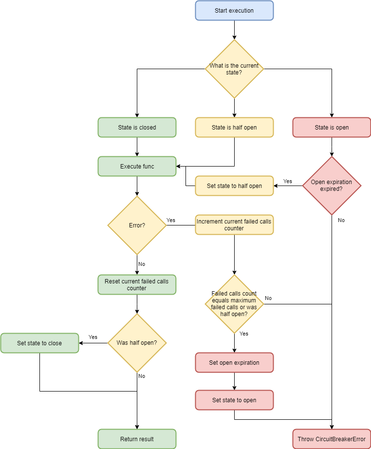

# Resilience Typescript

`resilience-typescript` is a Typescript resilience and transient-fault-handling library that allows developers to add components like **Timeout**, **Retry**, **Circuit Breaker**, **Cache**, **Token Cache** to outgoing HTTP(S) calls, built on top of the [Axios](https://github.com/axios/axios) library with a fluent language. Primarly designed for backend service to service communication.


## Installation

Run the following command:

`npm i resilience-typescript`

## Quickstart

### Basic CRUD Operations

You can create a resilient proxy that directly allows you to interact with a basic CRUD API server in a type save way with using e.g. a token cache, a circuit breaker, retry and timeout just like this:

```typescript
// The model our API is using
export class Person {
    public firstName: string;
    public lastName: string;
    public id: number;
}

// Lets create a resilient proxy to interact with our pipeline
const proxy = ResilientWebPipelineBuilder
    .New()
    .useConsoleLogger()
    .useAzureAdTokenProvider(...) // Parameters left out for brevity, all requests will use this token cache to authorize against the API and automatically set the 'Authorization'-Header
    .useCircuitBreaker(1, TimeSpansInMilliSeconds.TenMinutes, 10, TimeSpansInMilliSeconds.TenMinutes) // All requests will go first through a resilient circuit breaker
    .useRetry(2, 10) // All requests will do a retry before the circuit breaker
    .useTimeout(3, TimeSpansInMilliSeconds.OneSecond) // All requests will have a timeout before the retry
    .useBaseUrl("https://resilience-typescript.azurewebsites.net/api/persons") // The base URL for our web API
    .buildToCrud<Person>(); // We build to a basic CRUD proxy, safely typed to our person class.

// Now the proxy offers the following operations:
const list = await proxy.list(); // Gets an Axios response with all data from the API
const person: Person = { firstName: "Fabian", id: null, lastName: "Schwarz" }; // Our new model to add.
const add = await proxy.add(person);
const get = await proxy.get("1"); // Gets an item by its Id. All Ids are string, you maybe have to convert numbers or Guids to string.
person.firstName += " Resilience"; // Lets update first name of our model
person.lastName += " Typescript"; // And update last name too
const update = await proxy.update("1", person); // Send update request to the API
const delete = await proxy.delete("1"); // Send a delete request to the API
```

Given the example above, the operations will call the following endpoints:

* **list()**: GET <https://resilience-typescript.azurewebsites.net/api/persons>
* **get(id)**: GET <https://resilience-typescript.azurewebsites.net/api/persons/:id>
* **add(item)**: POST <https://resilience-typescript.azurewebsites.net/api/persons>
* **update(id, item)**: PUT <https://resilience-typescript.azurewebsites.net/api/persons/:id>
* **delete(id)**: DELETE <https://resilience-typescript.azurewebsites.net/api/persons/:id>

### Customizable Fluent Resilient Requests

The previous builder allowed us to interact only with fixed endpoints of an API. To be more flexible and still have all the benefits of a resilient pipeline, all within a fluent, human readable language, you can build your pipeline to a request factory. This is the core purpose and heart of this library.

```typescript
// The model our API is using
export class Person {
    public firstName: string;
    public lastName: string;
    public id: number;
}

// Lets create a resilient proxy to interact with our pipeline
const proxy = ResilientWebPipelineBuilder
    .New()
    .useConsoleLogger()
    .useAzureAdTokenProvider(...) // Parameters left out for brevity, all requests will use this token cache to authorize against the API and automatically set the 'Authorization'-Header
    .useCircuitBreaker(1, TimeSpansInMilliSeconds.TenMinutes, 10, TimeSpansInMilliSeconds.TenMinutes) // All requests will go first through a resilient circuit breaker
    .useRetry(2, 10) // All requests will do a retry before the circuit breaker
    .useTimeout(3, TimeSpansInMilliSeconds.OneSecond) // All requests will have a timeout before the retry
    .builtToRequestFactory(); // We build to a request factory.

// Now the proxy offers a request factory where all requests will flow through the resilient pipeline like this:
const list = await proxy
    .request()
    .get("https://my-api.com/api/persons")
    .execute<Person[]>();
const item = await proxy
    .request()
    .get("https://another-api-for-persons.com/api/persons/4")
    .execute<Person>();
const person: Person = { firstName: "Fabian", id: null, lastName: "Schwarz" }; // Our new model to add.
const add = await proxy
    .request()
    .post("https://my-api.com/api/persons")
    .withBody(person)
    .execute<Person>();
```

### Custom Axios Request Config

You can also create a pipeline where you can send custom Axios requets through using this example:

```typescript
// Lets create a resilient proxy to interact with our pipeline
const proxy = ResilientWebPipelineBuilder
    .New()
    .useConsoleLogger()
    .useAzureAdTokenProvider(...) // Parameters left out for brevity, all requests will use this token cache to authorize against the API and automatically set the 'Authorization'-Header
    .useCircuitBreaker(1, TimeSpansInMilliSeconds.TenMinutes, 10, TimeSpansInMilliSeconds.TenMinutes) // All requests will go first through a resilient circuit breaker
    .useRetry(2, 10) // All requests will do a retry before the circuit breaker
    .useTimeout(3, TimeSpansInMilliSeconds.OneSecond) // All requests will have a timeout before the retry
    .build(); // We build our basic proxy.

// Now we can send a custom Axios request through the pipeline:
const request = { } as AxiosRequestConfig;
request.method = "GET";
request.url = "https://resilience-typescript.azurewebsites.net/api/persons";
const list = await proxy.execute<Person[]>(request);
```

### Maintenance

Each of the builders above have a maintenace mode, where you can perform the following maintenance operations:

* Remove all entries of a memory cache
* Set the circuit breaker to a desired state
* Reset error count to zero for circuit breakers.

```typescript
// Clear all entries of a memory state.
proxy.maintenance()
    .cache()
    .clear();

// Reset error count to zero of circuit breakers.
proxy.maintenance()
    .circuitBreaker()
    .resetErrorCount();

// Close the circuit breakers.
proxy.maintenance()
    .circuitBreaker()
    .close();
```

## Components

### Pipeline

A pipeline of so called resilience proxies (like Timeout, Retry and Circuit Breaker) that allows you to chain components together. You can build for instance a highly resilient pipeline were a Timeout is followed by a retry, whose is followed then by a Circuit Breaker.


```typescript
const proxies: IResilienceProxy[] = [];
// Circuit Breaker calls Retry calls Timeout calls func
proxies.push(new CircuitBreakerProxy()); // Constructor is missing parameters for demonstration purpose!
proxies.push(new RetryProxy()); // Constructor is missing parameters for demonstration purpose!
proxies.push(new TimeoutProxy()); // Constructor is missing parameters for demonstration purpose!
const pipeline = new PipelineProxy(proxies);
const func = async () => {...}; // An async function that does the real work and must be resolved within the pipeline

// Executes func in timeout, then timeout result in retry, then the result of retry in circuit breaker.
const result = await pipeline.execute(func);
```

### Timeout

Checks if a promise resolves within a given timespan in ms. If not, it fails with a `TimeoutError`.


```typescript
const timeoutMs = 500; // The timeout in milli seconds.
const logger = new NoLogger(); // Empty logger, see Logging chapter.
const timeout = new TimeoutProxy(timeoutMs, new NoLogger()); // Create a new timeout proxy.
const func = async () => {...}; // An async function that does the real work and must be resoloved within the timeout
try {
    const result = await timeout.execute(func); // Executes the provided func if it does not resolve within the timespan, a TimeoutError will be thrown, else its result will be returned
} catch (e) {
    console.log(e.message); // A TimeoutError, its "innerError" contains the real error.
}
```

### Retry

Tries to execute a promise a serveral times. If the promise rejects every time, a `RetryError` is thrown containing the error causing the promise to reject in the `innerError` property.


```typescript
const retries = 3; // Number of retries
const logger = new NoLogger(); // Empty logger, see Logging chapter.
const retry = new RetryProxy(retries, new NoLogger()); // Create a new retry proxy.
const func = async () => {...}; // An async function that does the real work and shall be retried if it fails
try {
    const result = await retry.execute(func); // Executes the provided func at most three times if it fails.
} catch (e) {
    console.log(e.message); // A RetryError, its "innerError" contains the real error.
}
```

### Circuit Breaker

Allows a func to fail whithin a configurable timespan configurable times before failing fast on a subsequent func call. On failure a `CircuitBreakerError` will be thrown with the `innerError` property containing the real error.



```typescript
const breakDuration = TimeSpansInMilliSeconds.OneMinute; // If circuit breaker state is set to open, subsequent calls will fail fast within the next minute.
const maxFailedCalls = 5; // Circuit breaker will go into open state after five failed calls.
const logger = new NoLogger(); // Empty logger, see Logging chapter.
const leakTimeSpanInMilliSeconds = TimeSpansInMilliSeconds.TenMinutes; // Timespan within errors are counted
const circuitBreaker = new CircuitBreakerProxy(breakDuration, maxFailedCalls, leakTimeSpanInMilliSeconds, logger, null);
const func = async () => {...}; // An async function that does the real work
try {
    const result = await circuitBreaker.execute(func); // Executes the provided func at most three times if it fails.
} catch (e) {
    console.log(e.message); // A CircuitBreakerError, its "innerError" contains the real error.
}
```

### Baseline

A proxy that calculates an alarm level from a list of func execution durations. Writes warnings to logs if execution duration is above alarm level. Additionaly writes for each func execution statistics of durations on information log level.

```typescript
const startSamplingAfter = TimeSpansInMilliSeconds.TenMinutes; // A timespan after when sampling should start. Use this if server needs a longer time to start.
const maxSampleDuration = TimeSpansInMilliSeconds.TenMinutes; // A timespan within samples should be gathered after sampling start. If max sample duration has been reached or if max samples have been reached before, alarm level will be calculated.
const maxSamplesCount = 100; // The maximum number of samples.
const logger = new NoLogger(); // Empty logger, see Logging chapter.
const baseLine = new BaselineProxy(startSamplingAfter, maxSampleDuration, maxSamplesCount, logger);
const func = async () => {...}; // An async function that does the real work
const result = await baseLine.execute(func); // Executes the provided func does sampling or checks against alarm level is sampling is finished. Failed calls will be excluded!
```

### Token Cache

A component that uses an implementation of the `ITokenProvider` interface to request a **Bearer** authorization token. As long as this token does not expire, it will be added automatically to all subsequent web calls `Authorization` header. If the token expires, a new one will be automatically requested. A default implementation is available with the `DefaultTokenCache` class.


#### ITokenProvider

You can easily add your own authorization provider, by implementing the `ITokenProvider` provider where you request a token in any format and convert it to the general `Token` class:

```typescript
    /**
     * Gets an access token.
     * @returns An access token.
     */
    getToken(): Promise<Token>;
```

#### Azure Active Directory App Registration Token Provider

There's been already added a token provider for an Azure Active Directory App Registration. You'll need to provide the following information:

* `baseUrl`: Base URL for the token endpoint. Most of the time you'll be fine with <https://login.microsoftonline.com>
* `clientId`: The GUID of your app registration. You can find this in the Azure portal.
* `clientSecret`: A secret you've created for your app registration in the Azure portal.
* `tenantId`: The GUID of your Azure Active Directory. You can find this also in the Azure portal.
* `logger`: An implementation of the `ILogger<TState>` interface. You can find more information in the [Logging](#logging) section.

If no token can be retrieved whith the settings above, a `TokenProviderError` will be thrown.

```typescript
const baseUrl = "https://login.microsoftonline.com";
const clientId = "YOUR_CLIENT_ID";
const clientSecret = "YOUR_CLIENT_SECRET";
const tenantId = "YOUR_TENANT_ID";
const logger: ILogger<string> = new NoLogger();
const provider: ITokenProvider = new AzureActiveDirectoryAppRegistrationTokenProvider(baseUrl, clientId, clientSecret, tenantId, logger);

const result = await provider.getToken(); // A valid token for Bearer authorization that can be used by a token cache.
```

### Logging

This package contains its own logging mechanism but you can easily include your own logger by extending the `AbstractStringLogger` class, implementing the `protected abstract logHandler(logLevel: LogLevel, guid: Guid, state: string, error: Error, formatter: (s: string, guid: Guid, e: Error) => string): void;` method and calling your own logger inside of it. The _Guid_ is a unique Id for each request to be able to connect log messages to a specific request.

There are also three predefined logger already included:

* `ConsoleLogger`: A logger that writes every log message to the console.
* `AppInsightsLogger`: A logger that writes every log messages to Azure Application Insights. Please ensure you have correctly setup Application Insights using [this manual here](https://github.com/Microsoft/ApplicationInsights-node.js/) before using this logger, otherwise you application will crash. All logs will be added as _traces_ into Application Insights.
* `MultiLogger`: A logger that is a container for other loggers. It will be used if you specify more than one logger in the builders, e.g. a _ConsoleLogger_ and an _AppInsightsLogger_. The multi logger will then forward all messages to its two internal loggers.
* `NoLogger`: A logger that does nothing, it basically disables all logging.
* `TestLogger`: A logger that's primary designed for unit tests where you can provide a callback that will be called for each log message, to test if and what log messages are generated.

A example log ouput with a `ConsoleLogger` and `LogLevel.Information` where an endpoint returns three times a response code of 500 and succeeds on the fourth try looks like this:

```bash
IFORMATION: 2019-10-15 22:58:23.857 d94646ed-d988-91b3-dece-ed36144d5234 start GET 'https://resilience-typescript.azurewebsites.net/api/persons/6'
ERROR: 2019-10-15 22:58:24.167 d94646ed-d988-91b3-dece-ed36144d5234 Timeout failed with error "Request failed with status code 500"
WARNING: 2019-10-15 22:58:24.168 d94646ed-d988-91b3-dece-ed36144d5234 Retry 0/30 failed with error "Timeout failed"
ERROR: 2019-10-15 22:58:24.463 d94646ed-d988-91b3-dece-ed36144d5234 Timeout failed with error "Request failed with status code 500"
WARNING: 2019-10-15 22:58:24.501 d94646ed-d988-91b3-dece-ed36144d5234 Retry 1/30 failed with error "Timeout failed"
ERROR: 2019-10-15 22:58:24.830 d94646ed-d988-91b3-dece-ed36144d5234 Timeout failed with error "Request failed with status code 500"
WARNING: 2019-10-15 22:58:24.833 d94646ed-d988-91b3-dece-ed36144d5234 Retry 2/30 failed with error "Timeout failed"
INFORMATION: 2019-10-15 22:58:24.928 d94646ed-d988-91b3-dece-ed36144d5234 end 200 in 1070ms
```

### Cache

An interface to provide a caching mechanism to not always query a depended service. A default implementation is provided with the `MemoryCache`. You can easily create your own implementation by implementing the following interface:

```typescript
export interface ICache<TKey, TResult> {
    /**
     * Executes a function within a cache. If the value is in the cache and has not expired, it will be returned from the cache, else it will be queried from the func and added to the cache.
     * @param func Function to get the value if not in cache or has expired.
     * @param key The key to use for this value.
     */
    execute(func: (...args: any[]) => Promise<TResult>, key?: TKey): Promise<TResult>;
}
```

#### Memory Cache

A default implementation of a cache that stores all values in memory. To minimze memory usage, you can specify a sliding expiration of cache entries whereas garbage collection will take place on every configurable call to the cache. Also you can limit the maximum number of items in the cache.  


```typescript
const expirationTimeSpanMs = TimeSpansInMilliSeconds.OneHour; // Cache entries expire after one hour
const garbageCollectEveryXRequests = 100; // Removing of expired items will take place every 100 calls to the 'execute' function
const maxEntryCount = 500; // Cache holds 500 entries maximum. If more are added, the oldest will be removed.
const key = "KeyForFunc"; // The key for the result of the func. Must be provided.
const func = async () => {...}; // An async function that does the real work and whose result will be stored in the cache if not already present.
const cache = new MemoryCache<string>(expirationTimeSpanMs, logger, garbageCollectEveryXRequests, maxEntryCount);
try {
    const result = await cache.execute(func, key); // Returns a value from the cache if present or executes the func to get the value and stores it in the cache under the given key.
} catch (e) {
    console.log(e.message); // A CacheError, its "innerError" contains the real error.
}
```

### Queue

An interface to provide a queue in TypeScript, it is used in the `MemoryCache` to limit the maximum count of entries in the cache. A default implementation is provided with the `MemoryQueue`.

```typescript
/**
 * A queue with a defined maximum lenght.
 */
export interface IQueue<T> {
    /**
     * The maximum length of the queue.
     */
    readonly maxLength: number;

    /**
     * Adds a new item to the beginning of the queue.
     * @param value The item to add at the beginning of thequeue.
     * @returns An object describing whether a pop was required to add the item to the queue.
     */
    push(value: string): QueuePushResult<T>;

    /**
     * Removes the last item from the queue.
     * @returns The removed item of undefined.
     */
    pop(): T | undefined;
}
```

#### Memory Queue

A simple default implementation of a queue to limit the maximum count entries in the `MemoryCache`.

```typescript
const maxLength = 100; // Maximum size of the queue is 100 entries.
const queue = new MemoryQueue(maxLength, logger);
const result = queue.push("First"); // Adds a new entry to the queue.
const hasPoped = result.hasPoped; // Gets a value if a value was removed from the queue due to the size limit of the queue has reached.
const popedItem = result.popedItem; // Gets the value that was removed from the queue due to the size limit if any.
```

## Changelog

[The complete changlog can be found in the CHANGELOG.md file](./CHANGELOG.md)

## Code of conduct

[Discover the code of conduct in the CODE_OF_CONDUCT.md file](./CODE_OF_CONDUCT.md)

## Contributing

[The contributing guidelines can be read in the CONTRIBUTING.md file](./CONTRIBUTING.md)

## License

Unless stated otherwise all works are:

Copyright © 2019+ Fabian Schwarz
and licensed under:

[MIT License](./LICENSE)

## Buy me a coffee

[If you like this package you can buy me a coffee:](https://www.buymeacoffee.com/humppa123)
<a href="https://www.buymeacoffee.com/humppa123" target="_blank"></a>
